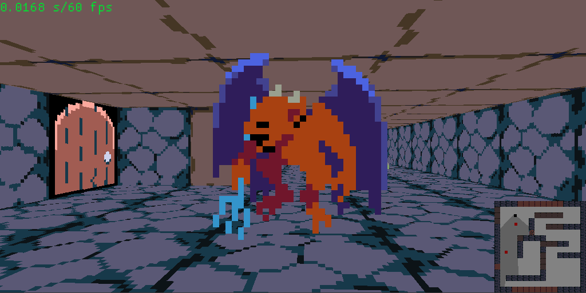

# dungeon_crawler
A simple dungeon crawler built in `macroquad`.



## Usage
```bash
cargo run --release
```

## Assets
* https://sethbb.itch.io/32rogues

## TO-DO
* [x] Extend by also doing floor and ceiling.
* [x] Fog
* [x] Player acceleration
* [x] Collision detection with ray casting
* [ ] Enemies
* [ ] Weapons
* [ ] Doors
* [ ] Directional sprites
* [ ] Objects
* [ ] Levels
* [ ] Items

## References
* https://github.com/ssloy/tinyraycaster
* https://lodev.org/cgtutor/raycasting2.html
* https://github.com/not-fl3/macroquad
