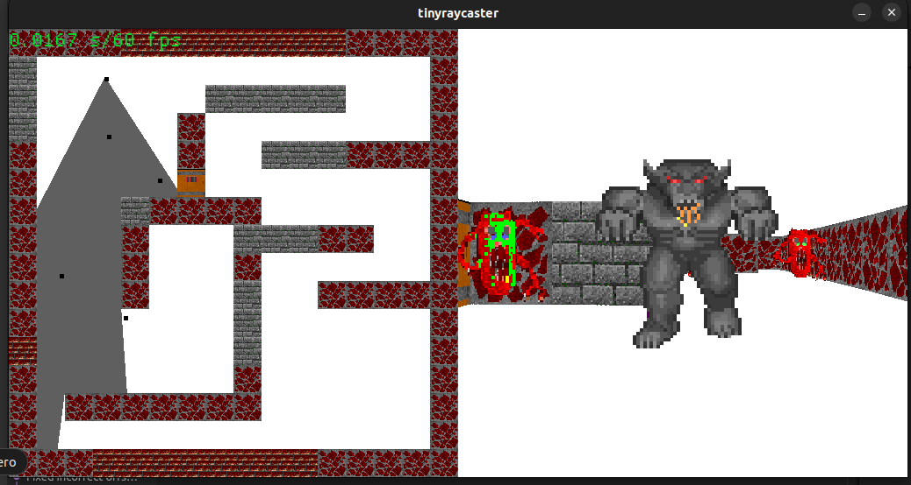

# tiny lectures

## tinyraycaster
From https://github.com/ssloy/tinyraycaster



## tinyrenderer
From https://github.com/ssloy/tinyrenderer

## Usage
```bash
make run
```

## TO-DO
* tinyraycaster
    * [ ] Make a small, stealth action game
    * [ ] Extend by also doing floor and ceiling. See https://lodev.org/cgtutor/raycasting2.html
